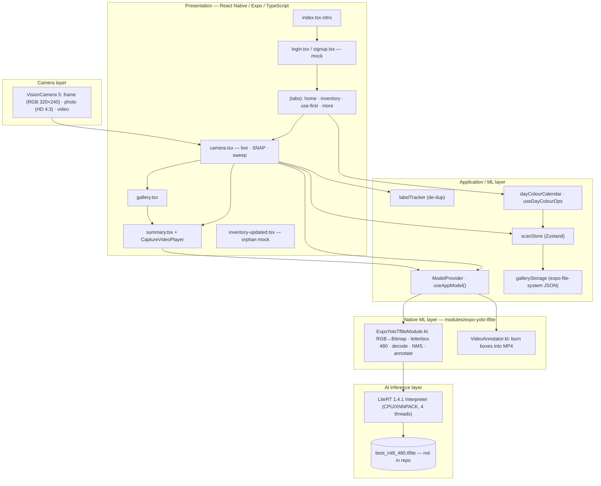
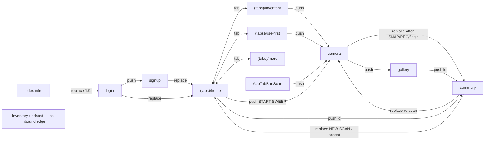
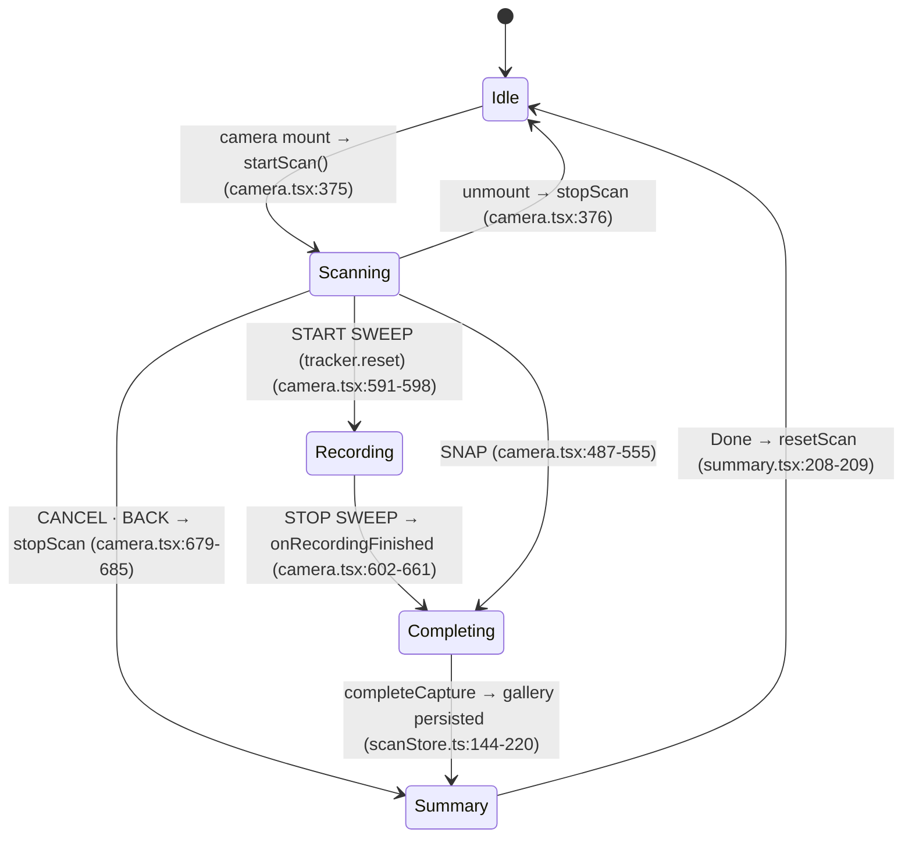
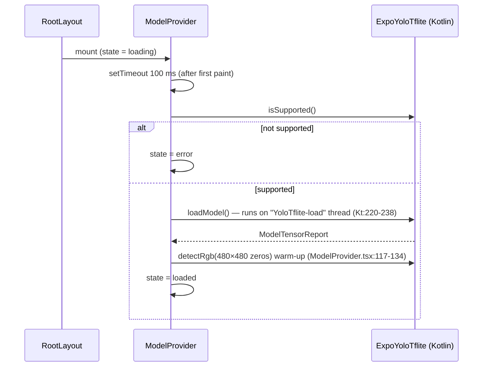
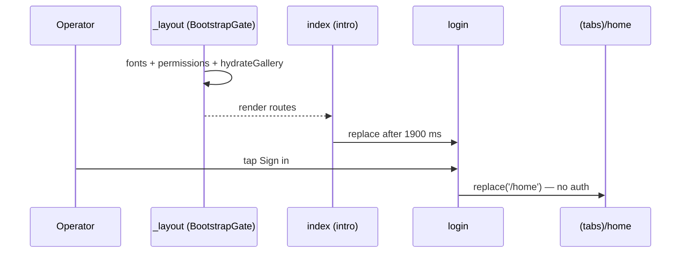
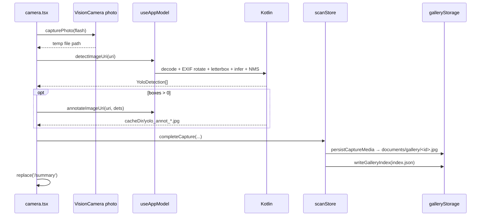

# ColorSweep — Architecture (as-built)

> **Status:** As-built, reverse-engineered on 2026-09-27 from base commit `f155d8c` and the approved HLD (sections 1–8; §9 missing, see `GAP-01`).
> Every technical claim cites `path:line`. HLD references use `HLD §x.y`.

Related: [requirements.md](requirements.md) · [contracts.md](contracts.md) · [test-strategy](../docs/test-strategy.md) · [traceability](../docs/traceability-matrix.md) · [review log](../docs/review-log.md)

---

## 1. Architecture overview

The four HLD layers (HLD §2.1) are present. The actual code adds an auth/intro shell and a tab dashboard above the scanning flow.



Evidence: routes `src/app/_layout.tsx:130-150`; model API `src/ml/ModelProvider.tsx:155-171`; native constants `modules/expo-yolo-tflite/android/src/main/java/expo/modules/yolotflite/ExpoYoloTfliteModule.kt:41-62`; camera outputs `src/app/camera.tsx:198-202`, `:340-349`.

> Path shorthand used below: `Kt` = `modules/expo-yolo-tflite/android/src/main/java/expo/modules/yolotflite/ExpoYoloTfliteModule.kt`; `VA` = `.../VideoAnnotator.kt`.

---

## 2. Architecture principles (HLD §2.2) — conformance

| Principle | Conformance | Evidence / note |
|---|---|---|
| 1. On-device first | **Conforms** | No network calls in `src/` or module sources; LiteRT local (`modules/expo-yolo-tflite/android/build.gradle:20-25`) |
| 2. Separation of responsibilities | **Partially conforms** | Native inference is isolated. But `camera.tsx` (1 396 lines) mixes UI, frame pipeline, recording and persistence orchestration (`src/app/camera.tsx:118-1038`) |
| 3. Native processing for performance | **Conforms, with one exception** | Letterbox/decode/NMS in Kotlin (`Kt:516-658`). RGB→Bitmap conversion is a per-pixel Kotlin loop (`Kt:406-437`) |
| 4. Reusable ML abstraction | **Conforms** | Screens use `useAppModel()` (`src/ml/ModelProvider.tsx:178-184`). Exception: `useTensorDebug` imports the native module directly (`src/ml/useTensorDebug.ts:2`, `:16-17`) |
| 5. Modular native integration | **Conforms** | Local module `modules/expo-yolo-tflite/`, linked as `file:` dependency (`package.json:28`) |
| 6. Extensibility (GPU, multi-tray, QR, cloud, iOS) | **Partially** | GPU delegate code exists but is dormant for INT8 assets (`Kt:247-306`); iOS stub (`modules/expo-yolo-tflite/ios/ExpoYoloTfliteModule.swift`); others absent |

---

## 3. Technology stack

| Layer | HLD technology (HLD §2.4) | Actual (installed / declared) | Evidence |
|---|---|---|---|
| Mobile framework | Expo / React Native | Expo **57.0.24**, React Native **0.86.3**, React **19.2.3** | `package.json:10`, `:29`, `:31` |
| Language | TypeScript | TypeScript **6.0.3** (strict) | `package.json:49`; `tsconfig.json:3-4` |
| Navigation | Expo Router | expo-router **57.0.22** (typed routes) | `package.json:20`; `app.json:46-49` |
| Camera | VisionCamera | react-native-vision-camera **5.2.3** + vision-camera-worklets **5.2.3** | `package.json:38-39` |
| Worklet processing | React Native Worklets | react-native-worklets **0.10.1** | `package.json:41` |
| State | Zustand | zustand **5.0.15** | `package.json:42` |
| Native module | Expo Modules API | `expo-yolo-tflite` 0.1.0 (local) | `modules/expo-yolo-tflite/package.json:3`; `expo-module.config.json` |
| Native language | Kotlin | Kotlin (Android); Swift stub (iOS) | `Kt`; `ios/ExpoYoloTfliteModule.swift` |
| ML runtime | LiteRT | LiteRT **1.4.1** (+ support, gpu, gpu-api) | `modules/expo-yolo-tflite/android/build.gradle:21-24` |
| ML model | YOLOv8n | YOLOv8-style detector, **480 input**, file `best_int8_480.tflite` (not in repo) | `Kt:42-46` |
| Model format | TFLite | TFLite | `Kt:245` |
| Annotation / training | Label Studio, Ultralytics, Colab | **Not in repo** (no notebooks, `data.yaml`, dataset) | repository tree |
| Build | Expo CNG / Gradle | Expo CNG; `android/` generated and git-ignored | `.gitignore:41-43` |
| Media (not in HLD) | — | expo-video **57.0.5**, expo-video-thumbnails **57.0.2**, expo-file-system **57.0.7** | `package.json:14`, `:25-26` |
| Animation / UI (not in HLD) | — | reanimated **4.5.1**, expo-linear-gradient, @expo/vector-icons, Inter + JetBrains Mono fonts | `package.json:6-9`, `:18`, `:35` |

---

## 4. Project structure

```text
cozable/
├── app.json                      Expo config (name "Cozable", Android package, permissions, minSdk 26)
├── assets/                       logo, gradient, icons; models/imagenet_labels.txt (unused leftover); app.json mirror
├── modules/expo-yolo-tflite/     local Expo native module
│   ├── index.ts, src/*.ts        TS API (+ web stub)
│   ├── android/                  build.gradle (LiteRT), Kotlin: ExpoYoloTfliteModule.kt, VideoAnnotator.kt
│   └── ios/                      Swift stub (throws "Android-only")
├── patches/                      react-native-fast-tflite patch — orphan (package not installed)
├── src/
│   ├── app/                      Expo Router routes (13 files)
│   │   ├── _layout.tsx           root Stack + ModelProvider + BootstrapGate
│   │   ├── (tabs)/               _layout, home, inventory, use-first, more
│   │   └── index, login, signup, camera, gallery, summary, inventory-updated
│   ├── components/               AppHeader, AppIcon, BottomNav (AppTabBar), CaptureVideoPlayer, StatusBadge*, AnimatedLogo*
│   ├── hooks/                    useDayColourOps; useCentroidTracking (empty file)
│   ├── ml/                       ModelProvider, prediction, useTensorDebug, colorName*
│   ├── store/scanStore.ts        Zustand store
│   ├── theme/scanner.ts          design tokens, day hex colours, VERIFY_THRESHOLD
│   ├── types/index.ts            domain types + thresholds
│   └── utils/                    dayColourCalendar, galleryStorage, labelTracker, scanHelpers
└── (no tests, no CI, no docs before this run)
```

`*` = not imported anywhere (`StatusBadge`, `AnimatedLogo`, `rgbToColorName`). Evidence: repository tree; usage search recorded in `docs/review-log.md` `RV-17`.

> ⚠️ As-built note (vs the team's structure hypothesis): gallery persistence is **`expo-file-system`** (JSON file), not AsyncStorage (`src/utils/galleryStorage.ts:1`, `:6-7`); `components/BottomNav.tsx` **is** the tab bar (`AppTabBar`), not a duplicate (`src/app/(tabs)/_layout.tsx:13-15`).

---

## 5. Screens and navigation

### 5.1 Route inventory

| Route file | Responsibility | Reached by | Leaves by | Android back |
|---|---|---|---|---|
| `_layout.tsx` | Root Stack; wraps `ModelProvider` and `BootstrapGate` (fonts, permissions, gallery hydrate) | — | — | — |
| `index.tsx` | Animated brand intro (1.9 s) | App start | `router.replace('/login')` (`src/app/index.tsx:57-59`) | Exits app (no history) |
| `login.tsx` | Login form — **mock** | Intro, sign-up "Login" | `router.replace('/home')` (`:23-25`); `push('/signup')` (`:128`) | Exits app |
| `signup.tsx` | Sign-up form — **mock** | Login | `replace('/home')` (`:27-30`); `back()` (header) ; `replace('/login')` | Back to login |
| `(tabs)/_layout.tsx` | Tabs: home, inventory, use-first, more; custom `AppTabBar` | Login/sign-up | — | — |
| `(tabs)/home.tsx` | Dashboard: today colour, week strip, weekly counts, latest scan, expected-count stepper | Tab (initial) | `push('/camera', {expectedCount})` (`:33-40`), `push('/gallery')`, `push('/summary', {id})` | Exits app (tabs are root after `replace`) |
| `(tabs)/inventory.tsx` | Colour "stock" list from this week's captures | Tab | `push('/camera')`, `push('/gallery')`, `push('/use-first')` | Previous tab / exit |
| `(tabs)/use-first.tsx` | Colours due today/tomorrow/overdue | Tab | `push('/camera')` (`:28`) | Previous tab / exit |
| `(tabs)/more.tsx` | Class → weekday rotation table | Tab | — | Previous tab / exit |
| `camera.tsx` | Expected-count prompt, live detection, SNAP, sweep (video) | Tab bar Scan (`components/BottomNav.tsx` `router.push('/camera')`), Home, Inventory, Use First; `replace` from Summary re-scan | `replace('/summary')` after SNAP/REC/finish (`:545-548`, `:657-660`, `:681-684`); `back()`; `push('/gallery')` | Back to caller |
| `gallery.tsx` | List, open, delete, clear, "Detect photos" | Home, Camera, Summary, Inventory header | `push('/summary', {id})` (`:123-126`); `back()` | Back |
| `summary.tsx` | Coverage report, rows, video report, re-scan, accept | Camera (`replace`), Gallery (`push`), Home | Done → `resetScan` + `replace('/home')`, or `back()` if from gallery (`:203-210`); re-scan → `replace('/camera', {expectedCount, rescanIndices})` (`:194-200`) | Back to previous screen (header ← runs `handleDone`) |
| `inventory-updated.tsx` | Success confirmation — **mock, orphan** | **No inbound navigation** | `replace('/inventory')`, `replace('/home')` (`:237`, `:246`) | — |

Registration: `src/app/_layout.tsx:137-149`. Tab order and Scan centre button: `src/app/(tabs)/_layout.tsx:25-29`; `src/components/BottomNav.tsx` (`AppTabBar`, centre `router.push('/camera')`).

### 5.2 Actual navigation graph



### 5.3 Mapping to HLD §3.3 (Start → Scan → Review → Summary)

| HLD step | As-built location |
|---|---|
| Home / Start (`index.tsx`, HLD §3.2) | **Moved** to `(tabs)/home.tsx` (START SWEEP / Scan) and the tab-bar Scan button; `index.tsx` is now an intro (`DEV-06`) |
| Scan (`camera.tsx`) | `camera.tsx` (live, SNAP, sweep) |
| Review (`gallery.tsx`) | `gallery.tsx` (reachable from camera, home, summary) |
| Summary (`summary.tsx`) | `summary.tsx` (+ video report) |

No duplicate tab bar exists: `BottomNav.tsx` provides the only tab bar component (`AppTabBar`).

---

## 6. Component responsibilities

| Component / hook | Purpose | Inputs → outputs | File |
|---|---|---|---|
| `ModelProvider` / `useAppModel()` | Load model, expose state and detection API | — → `{isLoaded, state, error, tensors, isReady, isSupported, detectImageUri, detectRgb, annotateImageUri, annotateVideoUri}` | `src/ml/ModelProvider.tsx:17-42`, `:84-184` |
| `useTensorDebug()` | Log tensor shapes once loaded | `isLoaded` → console | `src/ml/useTensorDebug.ts:9-37` |
| `LabelTracker` | Temporal IoU de-dup of labels across frames | detections + timestamp → `TrackedLabel[]` | `src/utils/labelTracker.ts:73-141` |
| `useDayColourOps()` | Weekly rotation + stock snapshot from gallery | `gallery`, now → `OpsSnapshot` | `src/hooks/useDayColourOps.ts:7-17` |
| `buildOpsSnapshot()` | Roll up gallery YOLO boxes of the current Sun–Sat week | gallery, date, threshold → stock / atRisk / useFirst / latestScan | `src/utils/dayColourCalendar.ts:314-443` |
| `CaptureVideoPlayer` | Play video; optional per-frame re-detect; full re-scan | `uri` → overlay boxes; `onScanComplete(reports, lastDets)` | `src/components/CaptureVideoPlayer.tsx:39-267` |
| `AppTabBar` | Custom tab bar with centre Scan | tab state → navigation | `src/components/BottomNav.tsx` |
| `AppHeader` | Header with optional icons | props → UI | `src/components/AppHeader.tsx` (used by inventory only) |
| `AppIcon` | MaterialCommunityIcons wrapper | name, size, color | `src/components/AppIcon.tsx:15-22` |
| `galleryStorage` | Persist media + JSON index | `CaptureMedia`/`GalleryItem[]` → files | `src/utils/galleryStorage.ts` |
| `scanHelpers` | URI helpers, dummy detections, capture description | — | `src/utils/scanHelpers.ts` |
| `useCentroidTracking` | **Empty file** (HLD §3.5 names it) | — | `src/hooks/useCentroidTracking.ts` (0 bytes) |

---

## 7. State management

### 7.1 `scanStore` shape (`src/store/scanStore.ts:58-107`)

| Field | Type | Initial | Meaning |
|---|---|---|---|
| `expectedCount` | `number` | `9` (`:110`) | Expected trays for coverage |
| `detections` | `TrayDetection[]` | `[]` | Distinct labels (or SNAP boxes, or dummy rows) for the active capture |
| `yoloDetections` | `StoredYoloDetection[]` | `[]` | Raw YOLO boxes for the active capture |
| `captureMedia` | `CaptureMedia \| null` | `null` | Active photo/video |
| `activeGalleryId` | `string \| null` | `null` | Gallery item being viewed |
| `gallery` | `GalleryItem[]` | `[]` | Persisted captures (newest first) |
| `galleryHydrated` | `boolean` | `false` | Index loaded |
| `isScanning` | `boolean` | `false` | Camera mounted and scanning |
| `predictionLog` | `PredictionLogEntry[]` | `[]` | Rolling log, max 80 (`:25`, `:132-134`) |

Actions: `setExpectedCount`, `setDetections`, `setYoloDetections`, `setCaptureMedia`, `logPrediction`, `clearPredictionLog` (unused), `completeCapture` (`:144-220`), `updateGalleryClassification`, `updateGalleryVideoReports`, `openGalleryItem`, `removeGalleryItem`, `clearGallery`, `hydrateGallery`, `resetScan`, `startScan`, `stopScan`, `galleryBytesUsed` (unused).

### 7.2 Readers and writers

| Screen | Reads | Writes |
|---|---|---|
| `_layout.tsx` | — | `hydrateGallery` (`:40`, `:84-98`) |
| `(tabs)/home.tsx` | `expectedCount`, `gallery` (via `useDayColourOps`) | `setExpectedCount` |
| `(tabs)/inventory`, `use-first`, `more` | `gallery` (via `useDayColourOps`) | — |
| `camera.tsx` | `expectedCount` | `setExpectedCount`, `startScan`, `stopScan`, `logPrediction`, `completeCapture` (`:129-134`) |
| `gallery.tsx` | `gallery`, `predictionLog` | `openGalleryItem`, `removeGalleryItem`, `clearGallery`, `updateGalleryClassification`, `logPrediction` (`:96-102`) |
| `summary.tsx` | `expectedCount`, `detections`, `yoloDetections`, `captureMedia`, `gallery`, `activeGalleryId` | `openGalleryItem`, `resetScan`, `updateGalleryVideoReports`, `setYoloDetections` (`:130-141`) |

Local-only state: camera uses refs for the tracker, frame reports, recording flags and frame dimensions (`src/app/camera.tsx:173-183`); `CaptureVideoPlayer` keeps overlay boxes locally.

### 7.3 Session lifecycle (as-built)



There is no session entity (id, start/end timestamps); a "session" is the store's active fields plus one gallery item. Summary's session label is `#SCN-<expectedCount>` for live scans (`src/app/summary.tsx:213-215`) — `GAP-06`.

---

## 8. ML integration boundary

- **HLD (§2.3.3, §3.7):** screens call `ModelProvider` (`detectRgb()`, `detectImageUri()`).
- **As-built:** `ModelProvider` is a React context provider mounted at the root (`src/app/_layout.tsx:158-162`); screens call the hook **`useAppModel()`** (`src/ml/ModelProvider.tsx:178-184`), which also exposes `annotateImageUri` and `annotateVideoUri` (`:33-41`).

**Loading lifecycle** (`src/ml/ModelProvider.tsx:90-153`):



States: `loading` → `loaded` | `error` (`src/ml/ModelProvider.tsx:15`). The splash does **not** wait for the model (`src/app/_layout.tsx:109-112`).

---

## 9. Camera and frame-processing pipeline

| # | Step | Thread / runtime | Evidence |
|---|---|---|---|
| 1 | VisionCamera frame output, `pixelFormat: 'rgb'`, `targetResolution: 320×240`, physical buffer rotation on, drop frames while busy | Camera / frame-processor worklet runtime | `src/app/camera.tsx:340-349`, `:56` |
| 2 | `onFrame` worklet increments a synchronizable frame counter; every 30 frames reports the count to JS | Worklet | `:291-299` |
| 3 | **Throttle:** time-based — inference due when `now − lastInferAt ≥ 100 ms` | Worklet | `:51`, `:302-303` |
| 4 | **Busy guard:** skip if `mlBusy` is true; require `hasPixelBuffer` | Worklet | `:304-309` |
| 5 | Copy pixels once (`new Uint8Array(frame.getPixelBuffer())`), derive stride/channels/BGRA; `frame.dispose()` | Worklet | `:310-330` |
| 6 | Set `mlBusy = true`; hand off with `scheduleOnRN(runDetectRgbOnJS, packet)` | Worklet → RN JS thread | `:332-335` |
| 7 | `detectRgb(...)` via `useAppModel` → Expo module `AsyncFunction` | JS → native (Expo module queue) | `:234-241`; `Kt:120-139` |
| 8 | Kotlin: RGB/BGRA bytes → ARGB `Bitmap` (per-pixel loop) | Native | `Kt:406-437` |
| 9 | Letterbox to 480×480 NCHW float, pad 114/255 | Native | `Kt:516-557` |
| 10 | `interpreter.run` (LiteRT, CPU XNNPACK 4 threads for INT8 asset) | Native | `Kt:452-453`; `Kt:295-305` |
| 11 | Decode (auto sigmoid, auto normalised-coords), conf ≥ 0.30, class-agnostic NMS IoU 0.30, top-20 | Native | `Kt:559-658` |
| 12 | Results → JS: overlay state, prediction log (class change or Δ ≥ 0.10), tracker update, video sample every 500 ms while recording | RN JS thread | `src/app/camera.tsx:250-280` |
| 13 | `mlBusy = false` in `finally` | RN JS thread | `:283-285` |

> ⚠️ As-built note: HLD §5.2 specifies VGA 4:3 frames and HLD §7.2 an every-6th-frame throttle (~5 Hz). The code uses 320×240 frames and a 100 ms time throttle (≤ ~10 Hz) — `DEV-03`, `DEV-04`. The inference itself runs at 480×480 regardless of frame size (`Kt:43`).

---

## 10. End-to-end workflows

### (a) App launch: intro → login → tabs
1. `RootLayout` mounts `ModelProvider` → `BootstrapGate` (`src/app/_layout.tsx:155-165`).
2. Gate loads fonts, prompts camera + mic once, hydrates gallery; hides splash when all three settle (`:46-117`). Model loads in parallel (`src/ml/ModelProvider.tsx:95`).
3. `index.tsx` animates for 1 900 ms → `replace('/login')` (`src/app/index.tsx:57-59`).
4. Login "Sign in" → `replace('/home')` with **no credential check** (`src/app/login.tsx:23-25`).



### (b) Scan session start → summary
1. Home START SWEEP sets expected count and pushes `/camera?expectedCount=n` (`src/app/(tabs)/home.tsx:33-40`). From the tab-bar Scan button no count is passed, so the camera prompts for 1–99 (`src/app/camera.tsx:702-740`).
2. Camera mount → `startScan()` (`:375`).
3. The operator SNAPs, records a sweep, or taps "CANCEL · BACK" (which navigates to **summary**, `:679-685`, `:1031-1033`).
4. `completeCapture` persists media and index (`src/store/scanStore.ts:144-220`) → `replace('/summary')`.

### (c) Live detection and the "sweep"
- **Live detection:** steps in [§9](#9-camera-and-frame-processing-pipeline); every inference also updates the `LabelTracker`, so a distinct count ("n of expected DETECTED") shows even without recording (`src/app/camera.tsx:262-267`, `:833-838`).
- **Sweep (definition):** a **video recording** started with START SWEEP. It resets the tracker (`:591-598`); while recording, each inference's detections are sampled into `VideoFrameReport`s every 500 ms (`:269-280`); the banner shows "SWEEP · n of expected distinct" (`:966-973`).

### (d) SNAP → annotate → gallery → persistence
1. `capturePhoto` (HD 4:3) → `saveToTemporaryFileAsync` (`src/app/camera.tsx:498-502`).
2. `detectImageUri(file://…)` fresh inference; on error, live boxes (`:506-516`).
3. If boxes exist, `annotateImageUri` writes `cacheDir/yolo_annot_<ts>.jpg` (`Kt:184-189`); that path becomes the media (`:518-526`).
4. `completeCapture(photo, expected, top, dets, null, yoloToTrayDetections(dets))` (`:528-543`) → copy media to `documents/gallery/<id>.jpg` and rewrite `index.json` (`src/utils/galleryStorage.ts:76-105`, `:67-73`); prune to 20 (`:107-120`).
5. `replace('/summary')`.



### (e) Video recording → de-dup → summary video report
1. START SWEEP → `createRecorder` + `startRecording` (`src/app/camera.tsx:599-603`).
2. Inference loop samples detections every 500 ms (`:269-280`) and updates the tracker.
3. STOP SWEEP → recording finished callback: distinct labels → `TrayDetection[]` (`trackedToTrayDetections`) and `StoredYoloDetection[]` (`:608-618`).
4. If frame reports exist, `annotateVideoUri` burns boxes into a new MP4 (10 fps, NV12/H.264, no audio, ≤ 450 frames) (`:630-643`; `VA:28-30`, `:93-99`, `:115`).
5. `completeCapture(video, …, frameReports, trays)` → summary.
6. Summary shows `CaptureVideoPlayer`: plays the stored MP4; "Live detect" re-runs YOLO on thumbnails at the current time (≥ 550 ms apart); "Re-scan video" re-detects up to 40 thumbnails and **overwrites** the stored frame reports (`src/components/CaptureVideoPlayer.tsx:19-21`, `:84-169`; `src/app/summary.tsx:365-375`).

> ⚠️ As-built note: HLD §6.4 says the MP4 is **not** re-processed frame-by-frame unless explicitly added. The code both **replays stored predictions** (burned into the annotated MP4 and listed as the frame-wise report, `src/app/summary.tsx:379-407`) **and** offers explicit re-processing (`DEV-09`).

### (f) Day-colour / expiry evaluation
1. `useDayColourOps()` memoises `buildOpsSnapshot(gallery, now, 0.85)` per calendar day (`src/hooks/useDayColourOps.ts:7-17`).
2. Week = Sunday 00:00 → Saturday 23:59:59.999 local (`src/utils/dayColourCalendar.ts:117-130`).
3. For each class id, due date = that weekday in the current week; `daysUntil < 0` → expired, `0` → today, `1` → tomorrow, else this-week (`:223-249`).
4. Gallery YOLO boxes from this week are counted per class → "stock" rows; expired/today = at risk (`:314-406`).

### (g) Permission-denied path
Bootstrap prompts once (`src/app/_layout.tsx:58-82`). If camera is still denied, the camera screen shows "Camera access required" with Allow / Open Settings (`src/app/camera.tsx:742-760`, `:407-418`). Recording without mic permission prompts or opens settings (`:562-573`).

### (h) Model-load failure path
`loadModel` throws (e.g. missing `best_int8_480.tflite`, `Kt:245`) → state `error`, logged (`src/ml/ModelProvider.tsx:140-145`; `src/app/_layout.tsx:100-103`). Camera shows "Model failed" as a status label; frames are dropped because `isLoaded` is false (`src/app/camera.tsx:226-229`, `:800-805`). SNAP still saves the photo using (empty) live boxes (`:514-516`). No retry is offered (`GAP-07`).

### (i) Inventory update flow (scope candidate)
`inventory-updated.tsx` exists but **no screen navigates to it** (only registered at `src/app/_layout.tsx:149`); its content is static (`src/app/inventory-updated.tsx:153-257`). Not an implemented flow.

---

## 11. Coordinate transformation (HLD §6.5)

| Space | Where | Conversion |
|---|---|---|
| **Frame buffer** (320×240 requested, physically rotated upright) | VisionCamera frame output | `enablePhysicalBufferRotation: true` (`src/app/camera.tsx:346`) — frame arrives upright |
| **Model input** (480×480 letterbox) | Kotlin | `scale = min(480/w, 480/h)`, centred pad (`Kt:516-524`) |
| **Source-normalised** (0..1, top-left x/y) | Kotlin decode | undo pad and scale, divide by source size, clamp (`Kt:608-616`) |
| **Preview** (screen) | `camera.tsx` overlay | `Camera resizeMode="contain"` (`:873`); contain letterbox with `scale = min(previewW/FW, previewH/FH)` and centred offsets (`:896-908`); front camera mirrors x (`:910-912`); minimum 60×30 px (`:914-915`) |
| **Captured JPEG** | Kotlin `annotateImageUri` | EXIF rotation applied on decode (`Kt:347-404`); normalised boxes × bitmap size (`Kt:167-176`) |
| **Video frame** | `VideoAnnotator` | normalised × frame size (`VA:299-303`); video player overlay uses contain letterbox (`src/components/CaptureVideoPlayer.tsx:176-198`) |

Cover scaling and cropping (HLD §6.5) are **not** handled because the preview uses `contain` (`DEV-10`). Frame dims for mapping come from the last packet (`src/app/camera.tsx:183`, `:233`).

---

## 12. Error handling

| Condition (HLD §7.5) | Handled where | User sees |
|---|---|---|
| Camera permission denied | `src/app/camera.tsx:742-760` | "Camera access required" + Allow / Open Settings |
| Camera unavailable | `:762-774` | "No camera device" + Try other lens |
| Camera initialisation / session failure | `:448-456`, `:776-798` | "Camera unavailable" + Retry / Open Settings / Go back (benign zoom/cancel errors ignored, `:103-110`) |
| Frame-output failure | `:281-282` (inference errors) | Nothing (warning log) |
| Photo capture failure | `:549-552` | Alert "Capture Error" |
| Video recording failure | `:663-676` | Alert "Recording Failure" / "Recording Error" |
| Model unavailable / loading failure | `src/ml/ModelProvider.tsx:97-103`, `:140-145` | Camera status "Model failed"; **no recovery** |
| Invalid tensor configuration | **Not handled** — shapes logged only (`src/ml/useTensorDebug.ts:17-32`) | Nothing |
| Inference failure | `src/app/camera.tsx:281-285`; SNAP fallback `:510-513` | Nothing / SNAP uses live boxes |
| Invalid image input | `Kt:111-112`, `:146-147` throw | SNAP falls back; annotation failure keeps raw photo (`src/app/camera.tsx:523-525`) |
| No detection returned | Normal path | Empty overlay; SNAP saves raw photo |
| Native module unavailable / unsupported platform | `src/ml/ModelProvider.tsx:97-103`; web stub throws; iOS throws | State `error` |
| Incorrect model asset | `Kt:245` throws → `error` state | "Model failed" |
| Runtime init failure (GPU) | GPU → CPU fallback (`Kt:270-305`) | Transparent |
| Gallery persistence failure | `src/store/scanStore.ts:208-219` | Summary shows temp capture; no alert |
| Annotated video encode failure | `src/app/camera.tsx:639-642`; `VA:191-193` | Raw video kept |

---

## 13. Logging and monitoring

| Tag / source | Level | Frequency | Evidence |
|---|---|---|---|
| `[LIVE] detectRgb → n` | log | **every inference** | `src/app/camera.tsx:242-247` |
| `[DETECT] count` / `box` | log | every inference | `:248-249` |
| `[RENDER] overlay` / `box` | log | every detections change | `:190-195` |
| `[FRAME] count` | log | every 30 frames | `:219-222` |
| `[CAM]`, `[REC]` | log | events | `:151-153`, `:620-638` |
| `[MODEL]`, `TENSORS:`, `[Bootstrap]` | log / error | load | `src/ml/ModelProvider.tsx:106-142`; `src/app/_layout.tsx:100-106` |
| `[YOLO] live/gallery → label` | log | each prediction-log entry | `src/store/scanStore.ts:127-131` |
| `[VideoDetect]` | warn | failures | `src/components/CaptureVideoPlayer.tsx:99`, `:154`, `:162` |
| Kotlin `YoloTflite` "TEMP DEBUG" RAW max score / box / count | `Log.d` | **every inference** | `Kt:473-511` |
| Kotlin `ExpoYoloTflite` decode stats | `Log.d` | every inference | `Kt:628-631` |
| Crash reporting | — | **TBD — none present** | no crash SDK in `package.json` |
| Debug tools | `useTensorDebug` (not dev-gated) | once per load | `src/app/camera.tsx:119-120` |

---

## 14. Performance

| Metric | HLD baseline (§5.7, §7.1) | As-built configuration | Status |
|---|---|---|---|
| Camera preview | ~30 FPS | device default | TBD — not measured |
| Inference frequency | ~5 Hz (every 6th frame) | ≤ ~10 Hz (100 ms throttle) | Deviates (`DEV-03`) |
| Inference input | 640×640 | 480×480 | Deviates (`DEV-01`) |
| Frame size | VGA 4:3 | 320×240 | Deviates (`DEV-04`) |
| CPU inference | ~120 ms | LiteRT CPU XNNPACK, 4 threads | TBD |
| RGB → Bitmap | ~15 ms | per-pixel Kotlin loop | TBD |
| End-to-end | ~150 ms | JS hand-off + native | TBD |
| In-flight inferences | 1 | 1 (`mlBusy`) | Met |

Known bottlenecks (from code): per-pixel `rgbToBitmap` (`Kt:416-435`) and letterbox loops (`Kt:531-552`); per-inference console and Logcat output (§13); `annotateVideoUri` re-encodes on the calling thread after recording (`VA:117-189`).

---

## 15. Security and privacy

| Topic | As-built | Evidence |
|---|---|---|
| Permissions | `CAMERA`, `RECORD_AUDIO` (Android); camera + microphone usage strings (iOS) | `app.json:14-15`, `:25-28` |
| Photo / video storage | Copied to app documents: `documents/gallery/<id>.<ext>`; index `documents/gallery/index.json` | `src/utils/galleryStorage.ts:6-7`, `:76-105` |
| Annotated temp files | `cacheDir/yolo_annot_<ts>.jpg`, `cacheDir/yolo_annot_vid_<ts>.mp4` | `Kt:184`; `VA:90` |
| Retention | Max 20 gallery items; oldest media deleted on prune; items whose file vanished are dropped on load | `src/types/index.ts:62`; `src/utils/galleryStorage.ts:53-60`, `:107-120`. Approved policy: **TBD** (`Q-05`) |
| Credentials | Login/sign-up store **nothing**; no tokens, no AsyncStorage/SecureStore | `src/app/login.tsx:18-25`; `src/app/signup.tsx:18-30` |
| Secrets | None in repo | repository search |
| Model protection | Model not in git by policy | `.gitignore:45-46` |
| Release hardening | `useTensorDebug` and per-frame logs are **not** stripped in release | `src/app/camera.tsx:120`; §13 |
| Network | None | FR-14 |

---

## 16. Build and deployment

- **Dev workflow (HLD §8.1–8.2):** `npm install` → `npx expo prebuild --clean` → `npx expo run:android`; JS-only changes: `npx expo start`. Scripts: `package.json:51-58`. A dev build is required (local native module).
- **Model deployment (HLD §8.3):** place the `.tflite` in `modules/expo-yolo-tflite/android/src/main/assets/` with the exact name in `Kt:42` (`best_int8_480.tflite`), rebuild natively, verify via `getTensorInfo()` / `TENSORS:` log. The file is git-ignored (`.gitignore:45-46`) and currently absent.
- **CI:** none (no `.github/`, no EAS config `eas.json`).
- **Stale script:** `reset-project` points to `./scripts/reset-project.js`, which does not exist (`package.json:53`).

---

## 17. Architecture decisions

| ID | Decision | Context | Consequences | Status |
|---|---|---|---|---|
| ADR-01 | On-device inference | Offline kitchens, latency (HLD §2.2.1, §7.3) | No backend; model ships with app | Accepted per HLD |
| ADR-02 | Kotlin Expo module instead of JS inference | Performance (HLD §2.2.3, §5.4) | Dev build required; Android-only | Accepted per HLD |
| ADR-03 | LiteRT with CPU/XNNPACK for INT8; GPU only for non-INT8 names | GPU+INT8 hangs on some devices (`Kt:247-249`) | Delegate chosen by file name substring | As-built, requires confirmation |
| ADR-04 | Zustand for session state | HLD §3.4 | Single store also holds gallery + log | Accepted per HLD |
| ADR-05 | Expo Router with intro → login → tabs shell | Added UI design (commit `d734a21`) | HLD linear flow replaced | As-built, requires confirmation |
| ADR-06 | Native, class-agnostic NMS, top-20 cap | "one sticker → one box" (`Kt:648`) | Different-class overlaps suppressed | As-built, requires confirmation (HLD §2.3.6: NMS native) |
| ADR-07 | Time-based 100 ms throttle + worklet busy flag | VisionCamera v5 has no `runAtTargetFps` (`src/app/camera.tsx:50`) | Up to ~10 Hz | As-built, requires confirmation (HLD: every 6th frame) |
| ADR-08 | 480×480 model input; 320×240 frame output | Speed | Smaller objects harder to detect | As-built, requires confirmation (HLD: 640, VGA) |
| ADR-09 | Gallery persisted as JSON + files in app documents | Keep results across restarts | Retention policy needed | As-built, requires confirmation |
| ADR-10 | Temporal IoU tracker for sweep de-dup | "same physical label counts once" (`src/utils/labelTracker.ts:69-72`) | No time window; tracks never expire | As-built, requires confirmation |
| ADR-11 | Model weights kept out of git | Size/IP (merge `d734a21`) | Clean clone cannot run inference | As-built, requires confirmation |

---

## 18. Deviations from the HLD

| ID | HLD says | Code does | Evidence | Impact | Proposed resolution |
|---|---|---|---|---|---|
| DEV-01 | Input 640×640; output `[1,11,8400]` (HLD §2.3.6, §4.2, §7.6) | Input 480; anchors 4 725; `NUM_ATTRS = 12` comment "box + objectness + classes" | `Kt:43-46`; warm-up 480 `src/ml/ModelProvider.tsx:47` | Model/doc mismatch; HLD tensor checks fail | Update HLD to 480, or re-export 640 |
| DEV-02 | Model packaged in native module assets (HLD §4.5, §8.3) | `best_int8_480.tflite` referenced, git-ignored, absent | `Kt:42`; `.gitignore:45-46` | Not reproducible | Define an artifact store + checksum |
| DEV-03 | Every ~6th frame, ~5 Hz (HLD §1.4.1, §7.2) | 100 ms time throttle, ≤ ~10 Hz | `src/app/camera.tsx:50-51` | Higher CPU load | Confirm rate; update HLD or constant |
| DEV-04 | VGA 4:3 frames (HLD §5.2) | 320×240 frames | `src/app/camera.tsx:56`, `:344` | Less detail per box | Confirm |
| DEV-05 | CPU delegate (HLD §2.3.6) | CPU for INT8; GPU attempted when name lacks "int8" | `Kt:247-306` | Behaviour depends on file name | Make delegate explicit |
| DEV-06 | `index.tsx` = Home/Start; flow Start → Scan → Review → Summary (HLD §3.2–3.3) | `index.tsx` = intro → login → tabs; start via Home/tab bar | `src/app/index.tsx:57-59`; `src/app/_layout.tsx:137-150` | Extra steps before scanning | Update HLD |
| DEV-07 | Gallery within the current session (HLD §1.4.4) | Persistent across sessions, 20 items, `expo-file-system` JSON | `src/utils/galleryStorage.ts:6-7`; `src/types/index.ts:62` | Privacy/retention | Confirm retention; update HLD |
| DEV-08 | `useCentroidTracking` provides tracking (HLD §3.5) | File empty; tracking in `utils/labelTracker.ts` | `src/hooks/useCentroidTracking.ts` (0 bytes) | Doc mismatch | Remove file or move tracker |
| DEV-09 | Video not re-processed (HLD §6.4) | Burned-in MP4 + player re-detect + full re-scan | `VA`; `src/components/CaptureVideoPlayer.tsx:60-169` | Extra CPU; overwrites reports | Confirm as approved addition |
| DEV-10 | Cover scaling / crop handled (HLD §6.5) | `contain` preview; min 60×30 box | `src/app/camera.tsx:873`, `:914-915` | Box alignment differs | Confirm |
| DEV-11 | API: status, load, unload, tensor info, detectRgb, detectImageUri, annotate (HLD §5.3) | Adds `annotateVideoUri`; web stub lacks it; iOS stub throws | `modules/expo-yolo-tflite/src/ExpoYoloTfliteModule.ts:27-31`; `.web.ts` | Web typing gap | Update HLD; add web stub |
| DEV-12 | Summary from session data (HLD §1.4.5) | Falls back to fabricated rows | `src/store/scanStore.ts:153-156`; `src/utils/scanHelpers.ts:10-29` | Misleading results | Remove fallback |
| DEV-13 | Inventory management out of scope (HLD §1.3); no auth/dashboard in HLD | Login/sign-up (mock), dashboard, inventory, use-first, inventory-updated | [requirements §7](requirements.md#7-features-implemented-but-not-in-the-hld) | Scope | Product decision |
| DEV-14 | `ModelProvider` is the screen-facing API (HLD §3.7) | Screens use `useAppModel()` hook from `ModelProvider.tsx` | `src/ml/ModelProvider.tsx:178-184` | Naming only | Update HLD wording |
| DEV-15 | Scan session entity created at start (HLD §6.6) | No session id/timestamps; label `#SCN-<expected>` | `src/app/summary.tsx:213-215` | Traceability | Add session id |

---

## 19. Risks

| Risk | Source | Likelihood | Impact | Mitigation |
|---|---|---|---|---|
| Data-limited model (needs 300+ real images) | HLD §8.4.5 | High | High | Collect data across lighting/angle/position; retrain |
| CPU-only latency | HLD §5.7 | Medium | Medium | Measure; GPU path for float models |
| Class-order mismatch | HLD §4.4 | Low (consistent today) | High | Single source of truth + test ([contracts §1](contracts.md#1-class-map-contract)) |
| Coordinate misalignment | HLD §6.5 | Medium | Medium | Contain math + min box size differ from HLD; test on device |
| Dev-build requirement | HLD §8.1 | Certain | Low | Document |
| Missing model file in repo | Code (`RV-01`) | Certain | High | Artifact storage + checksum + build check |
| Fabricated summary rows | Code (`RV-02`) | Medium | High | Remove dummy fallback |
| Mock auth mistaken for real | Code (`RV-04`) | Medium | High | Label as demo or implement |
| Misleading ERP/ISO claims | Code (`RV-03`) | Low (orphan) | High | Remove or gate screen |
| Annotated video loses audio / truncates at 45 s | Code (`RV-11`) | High for long sweeps | Medium | Keep original; mux audio; raise cap |
| Log volume per frame | Code (`RV-07`) | Certain | Low–Medium | Gate behind `__DEV__` |

---

## 20. Future roadmap (HLD §2.2.6) — Not implemented

| Item | Status |
|---|---|
| GPU acceleration | **Not implemented** as default (dormant code path for non-INT8 names, `Kt:247-293`) |
| Multi-tray detection | Not implemented |
| QR detection | Not implemented |
| Cloud synchronisation | Not implemented |
| iOS support | Not implemented (stub) |
| `runAtTargetFps(10)` (HLD §7.2) | Not available in VisionCamera v5; replaced by time throttle (`src/app/camera.tsx:50`) |
